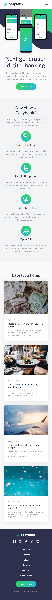

# Frontend Mentor - Easybank landing page solution

This is a solution to the [Easybank landing page challenge on Frontend Mentor](https://www.frontendmentor.io/challenges/easybank-landing-page-WaUhkoDN). Frontend Mentor challenges help you improve your coding skills by building realistic projects. 

## Table of contents

- [Overview](#overview)
  - [The challenge](#the-challenge)
  - [Screenshot](#screenshot)
  - [Links](#links)
- [My process](#my-process)
  - [Built with](#built-with)
  - [Continued development](#continued-development)
- [Author](#author)

## Overview

### The challenge

Users should be able to:

- View the optimal layout for the site depending on their device's screen size
- See hover states for all interactive elements on the page

### Screenshot

### Links

- Solution URL: [HTML](https://github.com/LazyCoder4542/easybank-landing-page-master/blob/master/index.html), [CSS](https://github.com/LazyCoder4542/easybank-landing-page-master/blob/master/style.css), [JavaScript](https://github.com/LazyCoder4542/easybank-landing-page-master/blob/master/script.js)
- Live Site URL: [Here](https://easybank-by-lazycoder.netlify.app)

## My process

### Built with

- Semantic HTML5 markup
- CSS custom properties
- Flexbox
- CSS Grid
- Mobile-first workflow
- [JQuery](https://jquery.com/) - JS library

### Continued development

- Improve in JQuery
- Starting Node.js

## Author

- Website - [Fadare Adeola Israel](https://lazycoder.great-site.net)
- Frontend Mentor - [@LazyCoder4542](https://www.frontendmentor.io/profile/LazyCoder4542)
- Twitter - [@MathFreak6](https://www.twitter.com/MathFreak6)
